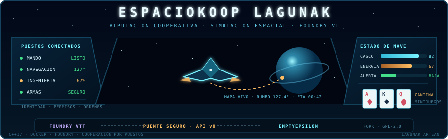

  

# Espaciokoop Lagunak

> Fork colaborativo de [EmptyEpsilon](https://github.com/daid/EmptyEpsilon) para juego, experimentación y desarrollo cooperativo entre personas y agentes de IA.

## Estado del proyecto

**Fase actual: 0 — preparación del fork.**

Espaciokoop Lagunak conserva el código y el historial de EmptyEpsilon y añade, por ahora, la base documental y colaborativa del fork. Todavía no se han publicado funcionalidades jugables propias ni se ha certificado una compilación local de este fork.

| Área | Estado | Evidencia / siguiente paso |
|---|---|---|
| Historial y atribución de EmptyEpsilon | Hecho | `main` parte de `upstream/master` sin reescribir historial |
| Licencia GPL-2.0 | Conservada | Véase [`LICENSE`](LICENSE) |
| Normas de colaboración | Hecho | [`CONTRIBUTING.md`](CONTRIBUTING.md) y [`AGENTS.md`](AGENTS.md) |
| Compilación reproducible | Pendiente de validar | Véase [`docs/BUILDING.md`](docs/BUILDING.md) |
| Ejecución con Docker | Planificada | Servidor y puente reproducibles, todavía no implementados |
| Integración con Foundry VTT | Prioridad estratégica | Diseño inicial en [`docs/FOUNDRY.md`](docs/FOUNDRY.md) |
| Cambios jugables propios | No iniciados | Primera iteración propuesta en el roadmap |
| Lanzamientos propios | No disponibles | Se crearán solo tras validar compilación y pruebas |

## Qué es

EmptyEpsilon es un simulador libre y multiplataforma de puente de mando espacial, escrito en C++17, construido con CMake y basado en el motor [SeriousProton](https://github.com/daid/SeriousProton) y SDL2. Permite que una tripulación reparta puestos —como mando, ingeniería, ciencia, comunicaciones o armas— entre varias pantallas.

**Espaciokoop Lagunak no es el proyecto oficial EmptyEpsilon.** Es un fork comunitario independiente mantenido por Varo y sus colaboradores. El código anterior a este fork, sus recursos y gran parte de su documentación pertenecen a sus autores originales. La web, documentación y versiones oficiales están en:

- Proyecto original: <https://github.com/daid/EmptyEpsilon>
- Web oficial: <https://daid.github.io/EmptyEpsilon/>
- Historial de cambios original: [`CHANGELOG.md`](CHANGELOG.md)

## Objetivos

1. Mantener una base jugable sincronizable con EmptyEpsilon.
2. Construir una experiencia cooperativa propia de forma incremental y verificable.
3. Facilitar que varias personas y agentes de IA colaboren sin duplicar trabajo ni introducir cambios opacos.
4. Documentar claramente qué procede de upstream y qué desarrolla este fork.
5. Priorizar cambios pequeños, revisables y compatibles con partidas reales.
6. Integrar la simulación con Foundry VTT para representar trayectos espaciales, gestión de nave y trabajo de tripulación dentro de campañas de rol como *Spelljammer*.

## Características

### Heredadas de EmptyEpsilon

El fork recibe de upstream, entre otras capacidades:

- Juego cooperativo con puestos de tripulación especializados.
- Partidas en red y distintos modos de pantalla.
- Escenarios y lógica de misiones en Lua.
- Game Master y múltiples facciones controladas por IA.
- Soporte original para Linux, Windows, macOS y Android.

Estas características son obra del proyecto EmptyEpsilon y sus contribuidores. Su presencia en upstream no implica que todas hayan sido verificadas todavía por el equipo de Espaciokoop Lagunak en cada plataforma.

### Propias de Espaciokoop Lagunak

Aún no hay características jugables propias publicadas. Esta sección se actualizará únicamente cuando un cambio esté integrado en `main` y tenga una verificación documentada.

La ejecución con Docker y la integración con Foundry VTT son objetivos prioritarios, pero aún no son características disponibles.

## Roadmap

El roadmap refleja intención, no promesas. Los cambios se concretarán mediante issues y pull requests.

### Fase 0 — Base colaborativa

- [x] Conservar historial, autoría y licencia de EmptyEpsilon.
- [x] Establecer `main` como rama principal del fork.
- [x] Añadir documentación para personas y agentes de IA.
- [x] Definir ramas, issues, pull requests y sincronización con upstream.
- [ ] Ejecutar y documentar una compilación limpia en Linux.
- [ ] Activar CI del fork y corregir cualquier incompatibilidad real.

### Fase 1 — Primera iteración jugable

- [ ] Arrancar una partida local con una compilación propia.
- [ ] Crear un escenario Lua mínimo, claramente identificado como propio.
- [ ] Añadir identidad visible de Espaciokoop Lagunak sin eliminar créditos originales.
- [ ] Probar conexión de al menos dos puestos de tripulación.
- [ ] Documentar instalación, arranque y resultado de la sesión de prueba.

**Criterio de salida:** una persona nueva puede compilar o instalar el juego siguiendo la documentación, iniciar el escenario del fork y conectar dos estaciones sin instrucciones privadas.

### Fase 2 — Docker y API segura

- [ ] Validar el modo servidor o sin interfaz de EmptyEpsilon.
- [ ] Crear una imagen Docker reproducible y un `compose.yaml` documentado.
- [ ] Mantener la simulación y el puente de integración en servicios separados y una red privada.
- [ ] Inventariar el API HTTP heredado y definir un contrato propio y versionado.
- [ ] Implementar un puente que solo permita operaciones autorizadas y nunca exponga `/exec.lua` directamente.
- [ ] Añadir autenticación, validación de mensajes, límites y comprobaciones de salud.

**Criterio de salida:** el servidor arranca de forma reproducible y el puente puede leer un estado seguro sin permitir ejecución Lua arbitraria desde Foundry.

### Fase 3 — Integración prioritaria con Foundry VTT

- [ ] Crear un módulo de Foundry VTT para el director de juego y la tripulación.
- [ ] Representar trayectos en tiempo real, con pausa y aceleración controladas por el director de juego.
- [ ] Sincronizar mapa, posición, rumbo, velocidad, destino y tiempo estimado de llegada.
- [ ] Gestionar motores, combustible o energía, temperatura, daños, reparaciones y recursos de la nave.
- [ ] Modelar puestos, permisos, turnos y acciones de la tripulación.
- [ ] Permitir al director de juego introducir encuentros, anomalías, averías y cambios narrativos.
- [ ] Enviar a Foundry eventos y resultados normalizados para diarios, escenas y fichas.
- [ ] Probar una sesión completa de *Spelljammer* con director de juego y varios puestos conectados.

**Criterio de salida:** una mesa de Foundry puede iniciar un trayecto, jugar su gestión operativa en Espaciokoop Lagunak y recibir el resultado en la campaña sin acceso directo a la API insegura heredada.

Diseño inicial: [`docs/FOUNDRY.md`](docs/FOUNDRY.md).

### Fase 4 — Experiencia cooperativa

- [ ] Recoger feedback de partidas mediante issues.
- [ ] Diseñar una campaña o conjunto de escenarios cooperativos.
- [ ] Mejorar accesibilidad, localización y experiencia de incorporación.
- [ ] Definir compatibilidad de red y política de versiones.

### Fase 5 — Distribución mantenible

- [ ] Automatizar artefactos reproducibles para plataformas validadas.
- [ ] Publicar notas de versión que separen cambios propios y de upstream.
- [ ] Establecer una cadencia segura de sincronización con EmptyEpsilon.

## Estructura del repositorio

| Ruta | Procedencia / propósito |
|---|---|
| `src/`, `scripts/`, `resources/`, `packs/` | Código, escenarios y recursos heredados principalmente de EmptyEpsilon |
| `CMakeLists.txt`, `cmake/` | Sistema de compilación original |
| `CHANGELOG.md` | Historial de cambios original de EmptyEpsilon |
| `LICENSE` | Licencia GNU GPL v2 conservada del proyecto original |
| `docs/` | Documentación específica del fork |
| `docker/` | Imagen del servidor headless y `compose.yaml` ([guía](docker/README.md)) |
| `bridge/` | Puente de integración con Foundry VTT ([contrato v0](bridge/README.md)) |
| `CONTRIBUTING.md` | Flujo colaborativo de Espaciokoop Lagunak |
| `AGENTS.md` | Reglas operativas para agentes de IA |
| `SECURITY.md` | Riesgos conocidos y cómo informar de vulnerabilidades |

Para conocer con precisión la relación con upstream, consulta [`docs/UPSTREAM.md`](docs/UPSTREAM.md).

## Compilación y desarrollo

La compilación necesita, como mínimo, un compilador C++17, CMake, SDL2 y una copia compatible de SeriousProton. No se incluye SeriousProton como submódulo: normalmente se clona junto a este repositorio y se indica su ruta a CMake.

Las instrucciones y el estado de validación están en [`docs/BUILDING.md`](docs/BUILDING.md). No interpretes estas instrucciones como garantía de compatibilidad en una plataforma no probada.

## Cómo colaborar

1. Lee [`CONTRIBUTING.md`](CONTRIBUTING.md).
2. Busca o crea un issue con alcance y criterio de aceptación claros.
3. Crea una rama desde `main`: `feature/<tema>`, `fix/<tema>` o `docs/<tema>`.
4. Haz un cambio pequeño y verificable.
5. Actualiza documentación y estado del roadmap si corresponde.
6. Abre un pull request; no hagas push directo a `main` tras el bootstrap.

Los agentes de IA deben leer además [`AGENTS.md`](AGENTS.md) antes de modificar archivos.

## Principios de colaboración humano–IA

- El issue y el pull request son la fuente compartida de contexto; no dependemos de conversaciones privadas.
- Nadie, humano o IA, afirma que algo funciona sin indicar cómo se comprobó.
- Una tarea debe declarar alcance, archivos afectados, pruebas y riesgos.
- No se mezclan objetivos independientes en un mismo pull request.
- No se fuerza `main` ni se reescribe trabajo ajeno.
- Los secretos nunca se copian a prompts, archivos, commits, logs o capturas.
- Una IA no debe realizar cambios destructivos, masivos o ambiguos sin autorización humana explícita.

## Ramas y remotos

- `origin`: fork de Espaciokoop Lagunak.
- `upstream`: repositorio oficial de EmptyEpsilon.
- `main`: rama estable e integrable del fork.
- Ramas de trabajo: cambios aislados, revisados mediante pull request.

La incorporación de cambios de EmptyEpsilon se realiza de forma explícita y sin `push --force`. Procedimiento completo: [`docs/UPSTREAM.md`](docs/UPSTREAM.md).

## Licencia y atribución

Este repositorio deriva de EmptyEpsilon y conserva su licencia **GNU General Public License, versión 2**. Consulta [`LICENSE`](LICENSE). Los autores originales mantienen la autoría de sus contribuciones; los cambios del fork pertenecen a sus respectivos contribuidores bajo la misma licencia aplicable.

Espaciokoop Lagunak no está afiliado ni respaldado oficialmente por el equipo de EmptyEpsilon.

## Recursos

- [EmptyEpsilon oficial](https://github.com/daid/EmptyEpsilon)
- [Web y manual oficial](https://daid.github.io/EmptyEpsilon/)
- [Guía de contribución del fork](CONTRIBUTING.md)
- [Compilación](docs/BUILDING.md)
- [Despliegue con Docker](docker/README.md)
- [Integración con Foundry VTT y gestión de nave](docs/FOUNDRY.md)
- [Puente de integración — contrato v0](bridge/README.md)
- [Inventario del API HTTP heredado](docs/API_HTTP.md)
- [Relación y sincronización con upstream](docs/UPSTREAM.md)
