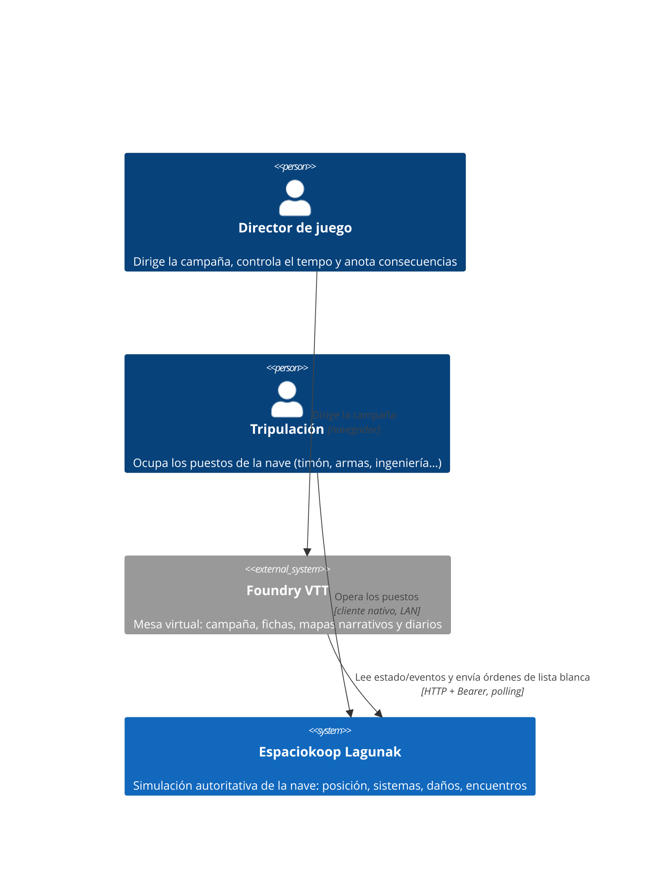
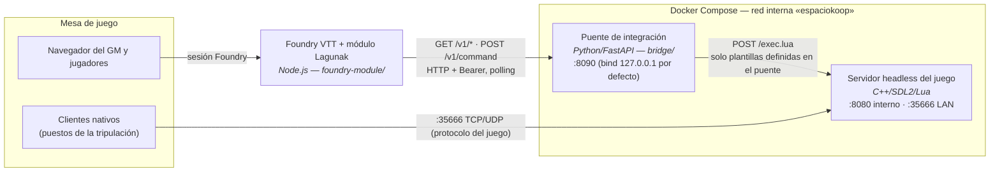
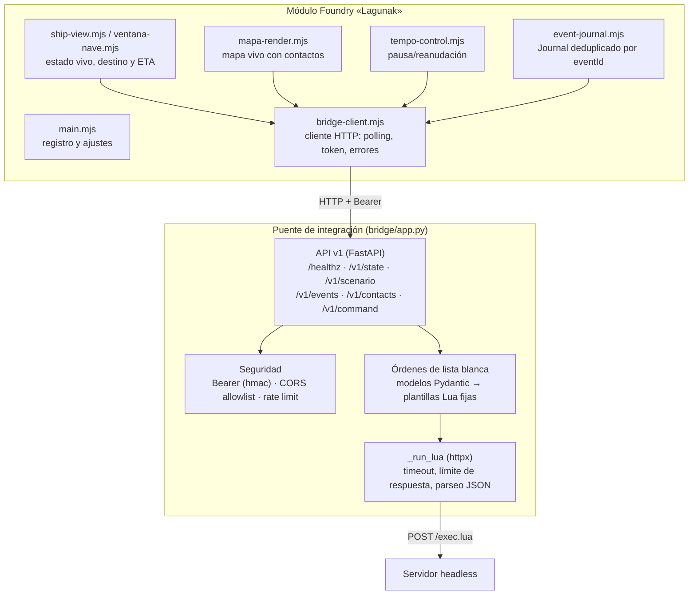
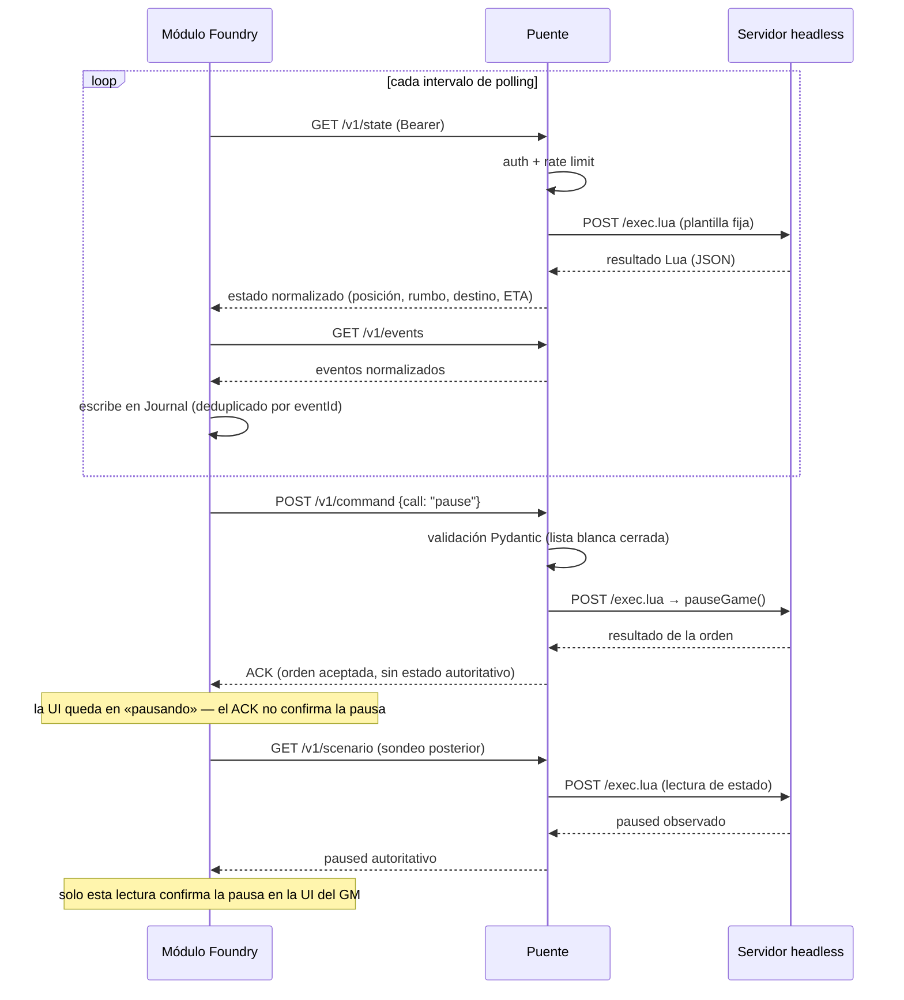

# Arquitectura del sistema — diagramas C4

Este documento explica cómo funciona la aplicación a distintos niveles de
zoom siguiendo el [modelo C4](https://c4model.com/) (estándar de facto para
documentar arquitecturas de software): **contexto → contenedores →
componentes**, más un diagrama de flujo de datos.

Los diagramas existen en dos formatos equivalentes:

- **Fuente editable draw.io**:
  [`docs/assets/diagramas/arquitectura.drawio`](assets/diagramas/arquitectura.drawio)
  (una página por nivel; se abre en [app.diagrams.net](https://app.diagrams.net/)
  o con la extensión *Draw.io Integration* de VS Code). Es la fuente de
  verdad visual: edítala y mantén este documento en sincronía.
- **Mermaid embebido** en este documento, para que GitHub los renderice sin
  herramientas.

Para la autoridad de cada dominio de datos y la visión de juego, ver
[`docs/FOUNDRY.md`](FOUNDRY.md). Para la superficie HTTP exacta,
[`docs/API_HTTP.md`](API_HTTP.md).

## Nivel 1 — Contexto del sistema

Quién usa el sistema y con qué habla. Espaciokoop Lagunak es la simulación
autoritativa de la nave; Foundry VTT (sistema externo) es autoritativo para
la narrativa de campaña.

## Nivel 2 — Contenedores

Las piezas desplegables y sus límites de red, según el despliegue de
referencia [`docker/compose.yaml`](../docker/README.md). La regla de
seguridad central: **el puerto :8080 del juego (con `/exec.lua`) no se
publica jamás al host**; solo el puente lo alcanza por la red interna.

| Contenedor | Tecnología | Responsabilidad |
|---|---|---|
| Servidor headless | C++ (fork de EmptyEpsilon), escenarios Lua | Simulación autoritativa de la nave y del escenario |
| Puente de integración | Python / FastAPI | Única pieza autorizada a hablar con `/exec.lua`: auth Bearer, CORS estricto, rate limit, órdenes de lista blanca |
| Módulo Foundry | JavaScript (módulo VTT) | Presenta el estado vivo al GM, escribe eventos en el Journal y envía órdenes cerradas |
| Clientes nativos | EmptyEpsilon de escritorio | Puestos de la tripulación por LAN |

## Nivel 3 — Componentes

Dentro del puente y del módulo Foundry (los dos contenedores propios de este
fork; el servidor del juego mantiene la arquitectura de EmptyEpsilon).

## Flujo de datos — polling y una orden

El transporte del contrato v0 está fijado en **polling HTTP** (issue #6). El
módulo nunca envía Lua: los fragmentos viven en el puente y las entradas del
cliente solo rellenan valores tipados y validados.

## Mantenimiento

- Si cambia la topología (nuevos contenedores, puertos, transporte), actualiza
  **primero** el `.drawio` y después los Mermaid de este documento.
- Los nombres de componentes deben coincidir con los ficheros reales
  (`bridge/app.py`, `foundry-module/scripts/*.mjs`); si renombras código,
  renombra aquí.
